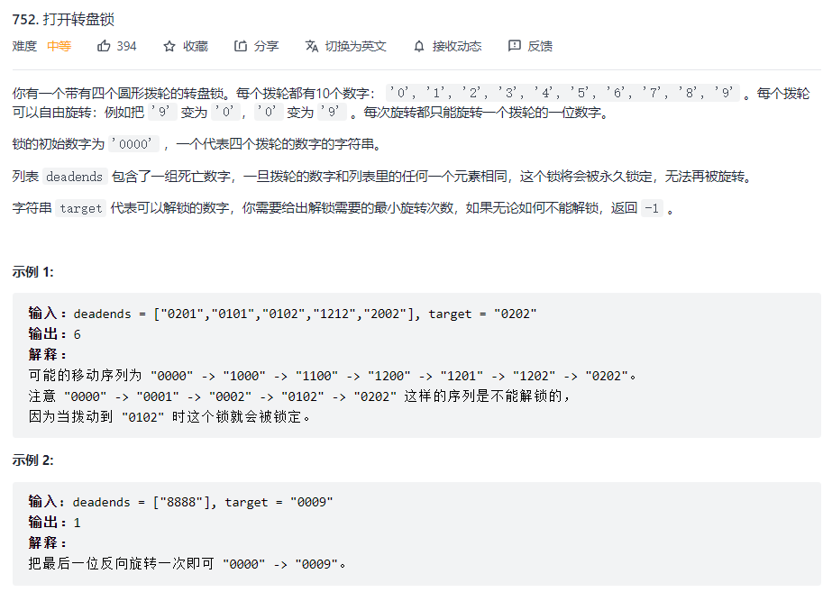

# 数据结构与算法 - BFS


### 框架
```
def BFS(start, target):
    queue = collections.deque()
    visited = set()
    queue.append(start)
    visited.add(start)
    step = 0
    
    while queue:
        size = len(queue)
        for i in range(size):
            cur = queue.popleft()
            if cur == target:
                return step
            for node in cur:
                if not node in visited():
                    queue.append(node)
                    visited.add(node)
        step += 1
    return step
```

### 例题 1 - 打开转盘锁
<https://leetcode-cn.com/problems/open-the-lock/>

```
class Solution:
    def up(self, code, index):
        code_list = list(code)
        if code_list[index] == '9':
            code_list[index] = '0'
        else:
            code_list[index] = str(int(code_list[index]) + 1)
        return ''.join(code_list)

    def down(self, code, index):
        code_list = list(code)
        if code_list[index] == '0':
            code_list[index] = '9'
        else:
            code_list[index] = str(int(code_list[index]) - 1)
        return ''.join(code_list)

    def openLock(self, deadends: List[str], target: str) -> int:
        queue = collections.deque()
        visited = set()

        # 将死亡数字视为已访问，避免进入分支
        for i in range(len(deadends)):
            visited.add(deadends[i])
        queue.append('0000')
        step = 0
        while queue:
            size = len(queue)
            for i in range(size):
                cur = queue.popleft()
                if cur == target:
                    return step
                if cur in visited:
                    continue

                visited.add(cur)
                
                for j in range(4):
                    code_up = self.up(cur, j)
                    if not code_up in visited:
                        queue.append(code_up)
                    code_down = self.down(cur, j)
                    if not code_down in visited:
                        queue.append(code_down)
            step += 1
        return -1
```

