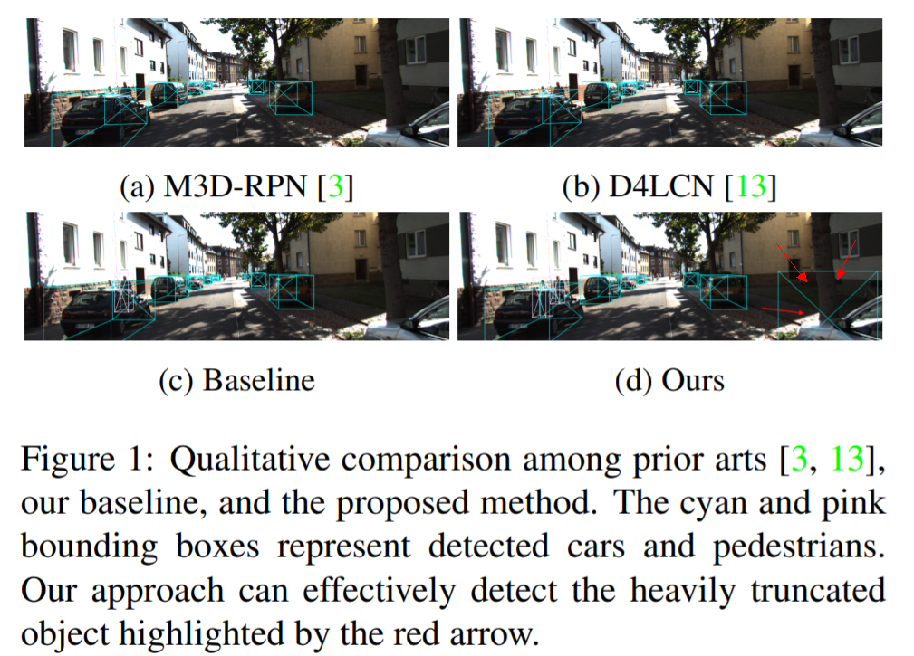

# MonoFlex阅读笔记

### Abstract

作者提出一个3D目标检测模型，将截断的目标解耦出来，并将多种深度估计方法结合使用。特别地，作者将特征图的边缘解耦，专门用于长尾分布的截断目标的检测，避免了对正常目标的影响。将目标深度估计公式化为，直接回归的目标深度，以及不同分组关键点求解的深度，进行不确定引导集成。实验证实，该方法比SOTA方法提升27%，KITTI benchmark保证实时的前提下提升30%。

### INTRODUCTION

SOTA方法对严重截断的目标检测效果仍然不好，然而这些目标对自动驾驶的安全性而言又是至关重要的。文章提出方法，对截断目标的检测效果有明显改善。

### References
1. [Objects are Different: Flexible Monocular 3D Object Detection](https://arxiv.org/abs/2104.02323)
2. <https://github.com/zhangyp15/MonoFlex>
