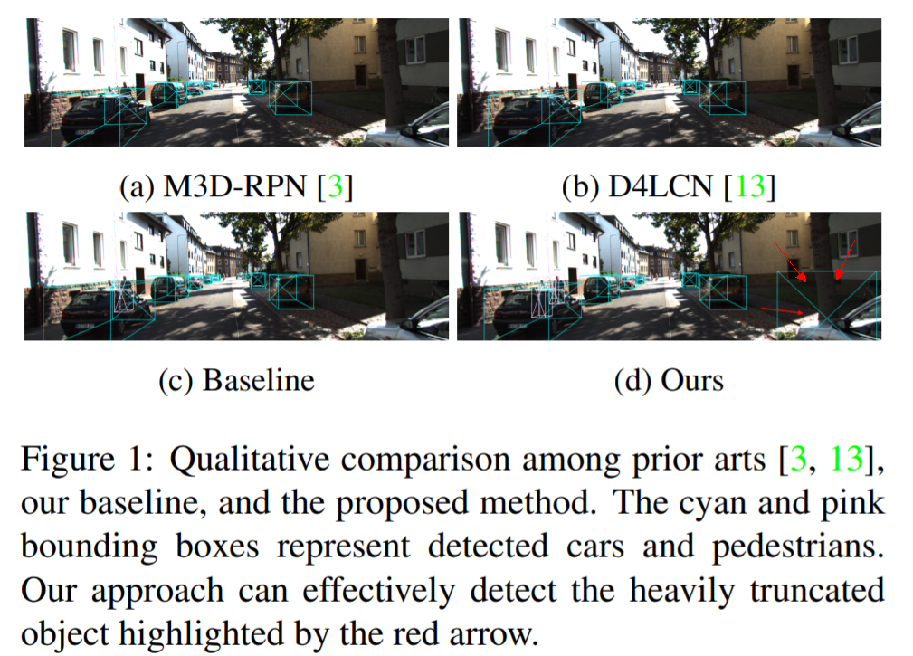

# Swin-Transformer笔记

### 前期工作
why
- 优美
- 统一建模
- 知识共享

VIT
- 示意图
- 问题
  - 未考虑视觉信号特点，平移不变性，只适合分类，不适合更精细的问题
  - global attention，计算量跟分辨率指数关系

### Swin-Transformer

<https://github.com/microsoft/Swin-Transformer>
<https://paperswithcode.com/>

SOTA方法对严重截断的目标检测效果仍然不好，然而这些目标对自动驾驶的安全性而言又是至关重要的。文章提出方法，对截断目标的检测效果有明显改善。

### References
1. [Objects are Different: Flexible Monocular 3D Object Detection](https://arxiv.org/abs/2104.02323)
2. <https://github.com/zhangyp15/MonoFlex>
