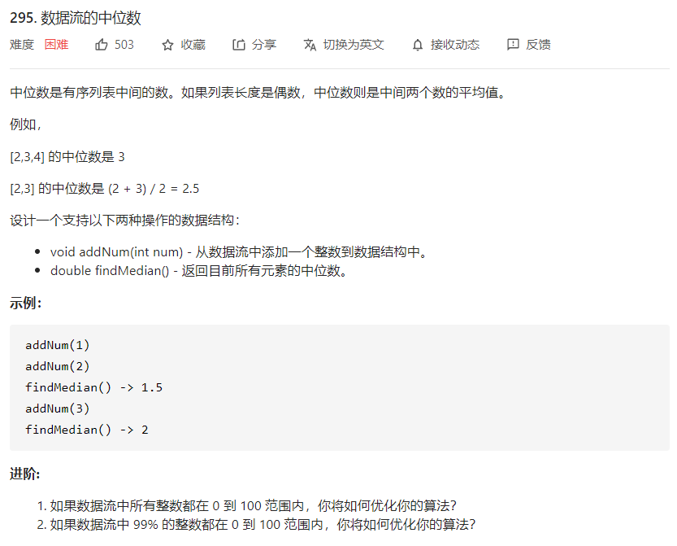

# 数据结构与算法 - 优先队列


### 简介

优先队列算法，也成为堆队列算法。堆是一个二叉树，它的每个父节点都小于等于孩子节点。heapq实现了一个适合与Python的列表一起使用的最小堆排序算法，即heap[0]始终为最小元素。若要使用最大堆，可以将元素取相反数后入堆。

### 例题 1 - 数据流的中位数
<https://leetcode-cn.com/problems/find-median-from-data-stream/>

```

class MedianFinder:

    def __init__(self):
        """
        initialize your data structure here.
        """
        # 结合列表来使用heapq模块
        # queMin内为小于等于中位数的值，queMin[0]为中位数左侧值的相反数，长度可能比queMax长度大1
        self.queMin = []
        self.queMax = []


    def addNum(self, num: int) -> None:
        queMin = self.queMin
        queMax = self.queMax

        if not queMin or num < -queMin[0]:
            # 先入queMin，若比queMax长度大2，则出堆并入queMax
            heapq.heappush(queMin, -num)
            if len(queMin) > len(queMax) + 1:
                heapq.heappush(queMax, -heapq.heappop(queMin))
        else:
            # 先入queMax，若比queMin长度大，则出堆并入queMin
            heapq.heappush(queMax, num)
            if len(queMax) > len(queMin):
                heapq.heappush(queMin, -heapq.heappop(queMax))


    def findMedian(self) -> float:
        if len(self.queMin) > len(self.queMax):
            return -self.queMin[0]
        else:
            return (self.queMax[0] - self.queMin[0]) / 2
```
