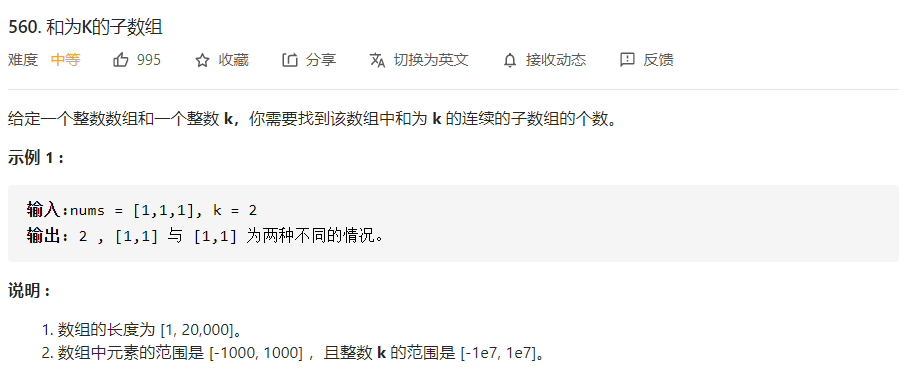
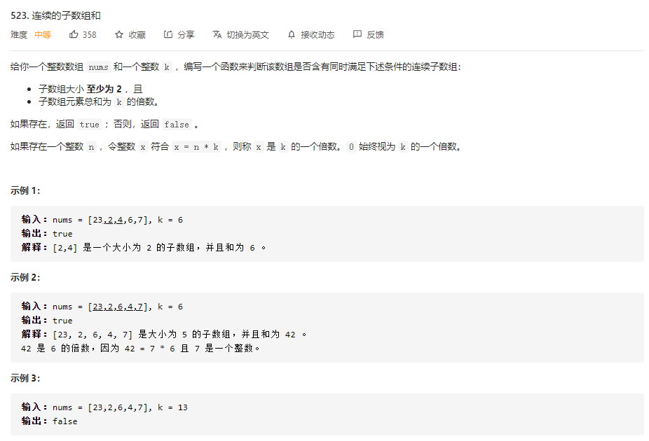

# 数据结构与算法 - 前缀和


### 简介

前缀和主要适用的场景是原始数组不会被修改的情况下，频繁查询某个区间的累加和。

### 例题 1 - 和为K的子数组
<https://leetcode-cn.com/problems/subarray-sum-equals-k/>

```
class Solution:
    def subarraySum(self, nums: List[int], k: int) -> int:
        num_times = collections.defaultdict(int) # 某前缀和出现的次数
        num_times[0] = 1  # 先给定一个初值处理nums[0] = k的情况
        cur_sum = 0
        res = 0
        for i in range(len(nums)):
            cur_sum += nums[i]  # 计算当前前缀和
            if cur_sum - k in num_times: # 若该前缀和出现过，则res加上出现的次数
                res += num_times[cur_sum - k]
            num_times[cur_sum] += 1
        return res
```

### 例题2 - 连续的子数组和
<https://leetcode-cn.com/problems/continuous-subarray-sum/>

```
class Solution:
    def checkSubarraySum(self, nums: List[int], k: int) -> bool:
        index_dict = dict() # 字典中存放余数第一次出现的索引，这里使用到同余定理，
                            # 即a、b除k的余数相同时a - b能被k整除
        cur_sum = 0
        pre_sum = []
        res = False
        index_dict[0] = -1  # 处理余数为0的情况
        for i in range(len(nums)):
            cur_sum += nums[i]
            remainder = cur_sum % k
            if remainder not in index_dict:
                index_dict[remainder] = i
                continue
            if i - index_dict[remainder] > 1:
                res = True
        return res
```
