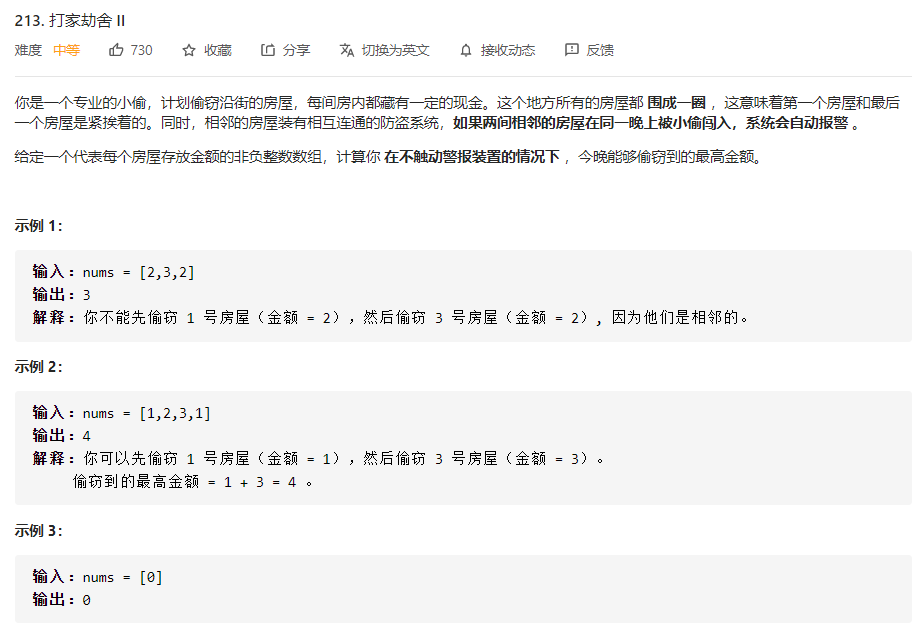
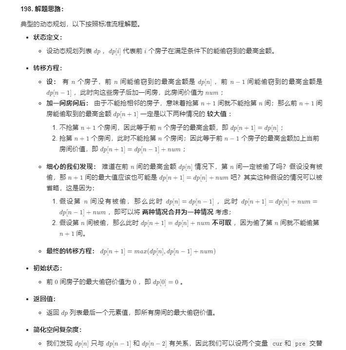

# 数据结构与算法 - 动态规划


### 简介
- 状态定义
- 状态转移方程
- 初始状态
- 返回值

### 例题 1 - 打家劫舍II
<https://leetcode-cn.com/problems/house-robber-ii/>


```
class Solution:
    def rob(self, nums: [int]) -> int:
        def my_rob(nums):
            cur, pre = 0, 0
            for num in nums:
                cur, pre = max(pre + num, cur), cur
            return cur
        return max(my_rob(nums[:-1]),my_rob(nums[1:])) if len(nums) != 1 else nums[0]
```
