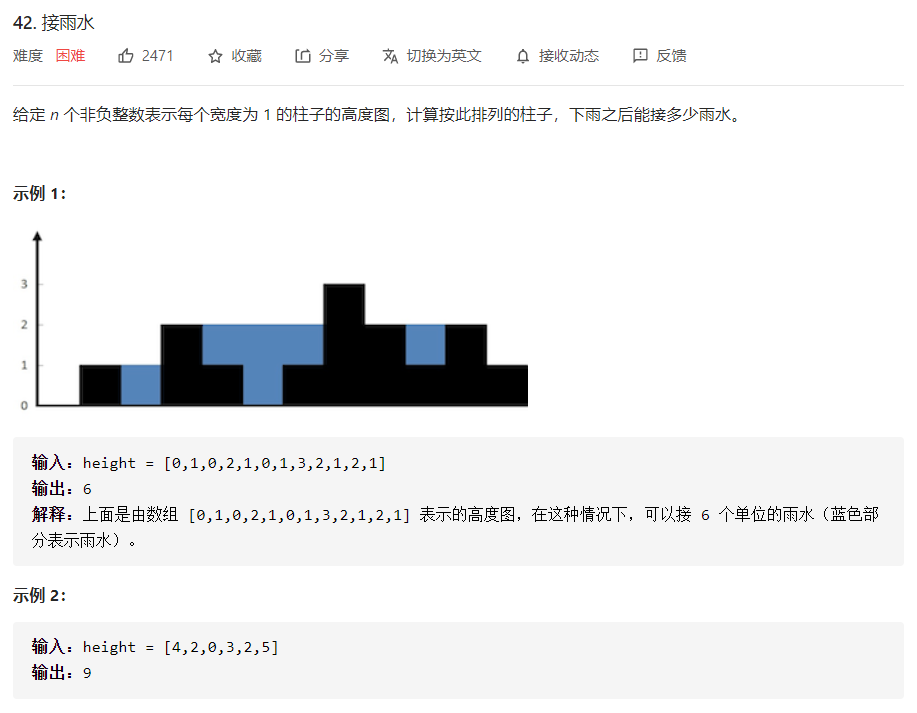

# 数据结构与算法 - 单调栈


### 性质
- 单调递减栈，能表示入栈元素左边第一个比它大的元素。入栈表明本身比栈顶小，出栈表面本身比栈顶大；
- 单调递增栈，能表示入栈元素左边第一个比它小的元素。入栈表明本身比栈顶大，出栈表面本身比栈顶小；

### 例题 - 接雨水
<https://leetcode-cn.com/problems/trapping-rain-water/>


```
class Solution:
    def trap(self, height: List[int]) -> int:
        if len(height) == 0:
            return 0
        sumArea = 0
        stack = []
        for right in range(len(height)):
            while stack and height[stack[-1]] < height[right]:
                if len(stack) >= 2:
                    bottom = stack.pop()
                    left = stack[-1]
                    waterHeight = min(height[right], height[left]) - height[bottom]
                    waterWidth = right - left - 1
                    currArea = waterHeight*waterWidth
                    sumArea += currArea
                else:
                    stack.pop()
            stack.append(right)
        return sumArea
```
