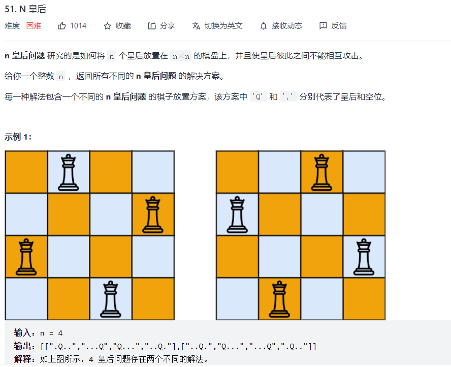

# 数据结构与算法 - 回溯&DFS


### 简介

解决一个回溯问题，实际上就是一个决策树的遍历过程。你只需要思考 3 个问题：

1. 路径：也就是已经做出的选择。

2. 选择列表：也就是你当前可以做的选择。

3. 结束条件：也就是到达决策树底层，无法再做选择的条件。

### 框架
```
result = []
def backtrack(路径, 选择列表):
    if 满足结束条件:
        result.add(路径)
        return
    
    for 选择 in 选择列表:
        做选择
        backtrack(路径, 选择列表)
        撤销选择
```

### 例题 1 - N皇后
<https://leetcode-cn.com/problems/n-queens/>


```
class Solution:
    def __init__(self):
        self.res = []

    def isvalid(self, board, row, col):
        # 无需检查行，因为按行遍历，每行只会有一个

        # 检查列
        r, c = row - 1, col
        while(r >= 0):
            if board[r][c] == "Q":
                return False
            r -= 1

        # 检查左上
        r, c = row - 1, col - 1
        while(r >= 0 and c >= 0):
            if board[r][c] == "Q":
                return False
            r -= 1
            c -= 1
        
        # 检查右上
        r, c = row - 1, col + 1
        while(r >= 0 and c <= len(board) - 1):
            if board[r][c] == "Q":
                return False
            r -= 1
            c += 1
        
        return True

    def update_row(self, board, row, col, l):
        # python中str类型不能直接修改，可以用字符串拼接
        if col == 0:
            board[row] = l + board[row][1:]
        elif col == len(board) - 1:
            board[row] = board[row][:col] + l
        else:
            board[row] = board[row][:col] + l + board[row][col + 1:]

    def traceback(self, board, row):
        # 套用回溯框架
        if len(board) == row:
            self.res.append(copy.deepcopy(board)) # 注意这里用深拷贝，因为回溯过程会不断修改board
            return

        for col in range(len(board)):
            if not self.isvalid(board, row, col):
                continue
            self.update_row(board, row, col, "Q")
            self.traceback(board, row + 1)
            self.update_row(board, row, col, ".")

    def solveNQueens(self, n: int) -> List[List[str]]:
        board = ["."*n for _ in range(n)]
        self.traceback(board, 0)
        return self.res
```
