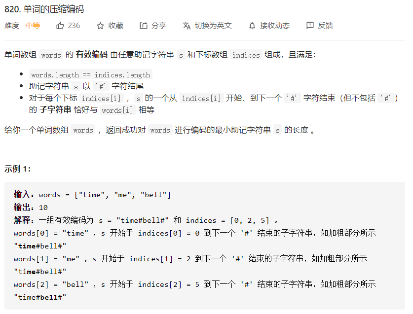

# 数据结构与算法 - 字典树


### 简介
<https://leetcode-cn.com/problems/short-encoding-of-words/solution/99-java-trie-tu-xie-gong-lue-bao-jiao-bao-hui-by-s/>

字典树，也叫Trie树或前缀树。典型应用是用于统计和排序大量的字符串（但不仅限于字符串），所以经常被搜索引擎系统用于文本词频统计。它的优点是：最大限度地减少无谓的字符串比较。

**这类很明显是用字典树去做的题目，明显特征就是需要大量地判断某个字符串是否是给定单词列表中的前缀/后缀。** 为什么要说后缀也可以呢？因为把单词倒着插入，就可以搜后缀了。

### 模板
```
class TrieNode:
    def __init__(self):
        self.count = 0
        self.preCount = 0
        self.children = {}

class Trie:

    def __init__(self):
        self.root = TrieNode()

    def insert(self, word): # 插入一个单词
        node = self.root
        for ch in word:
            if ch not in node.children:
                node.children[ch] = TrieNode()
            node = node.children[ch]
            node.preCount += 1
        node.count += 1

    def search(self, word): # 查找一个单词是否存在
        node = self.root
        for ch in word:
            if ch not in node.children:
                return False
            node = node.children[ch]
        return node.count > 0

    def startsWith(self, prefix): # 查找是否存在以 word 为前缀的单词
        node = self.root
        for ch in prefix:
            if ch not in node.children:
                return False
            node = node.children[ch]
        return node.preCount > 0

```

### 例题 1 - 单词的压缩编码（后缀树）
<https://leetcode-cn.com/problems/short-encoding-of-words/>

```
class Trie: # 构造字典树
    def __init__(self):
        """
        Initialize your data structure here.
        """
        self.Trie = {}

    def insert(self, word):
        """
        Inserts a word into the trie.
        :type word: str
        :rtype: void
        """
        curr = self.Trie
        for w in word:
            if w not in curr:
                curr[w] = {}
            curr = curr[w]
        curr['#'] = 1

    def isTail(self, word):
        """
        Returns if the word is in the trie.
        :type word: str
        :rtype: bool
        """
        curr = self.Trie
        for w in word:
            curr = curr[w]
        return len(curr) == 1 
class Solution:
    def minimumLengthEncoding(self, words: List[str]) -> int:
        trie = Trie()
        cnt = 0
        words = set(words)
        for word in words:
            trie.insert(word[::-1])
        for word in words:
            if trie.isTail(word[::-1]):
                cnt += len(word) + 1
        return cnt

```
