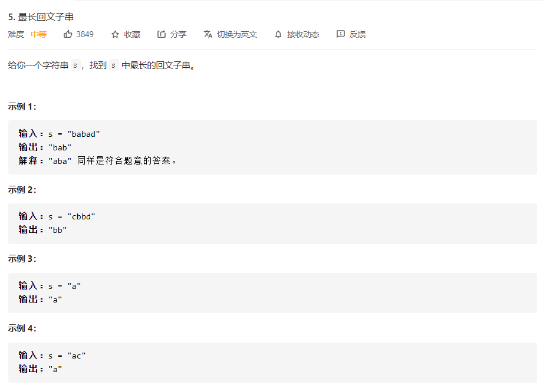
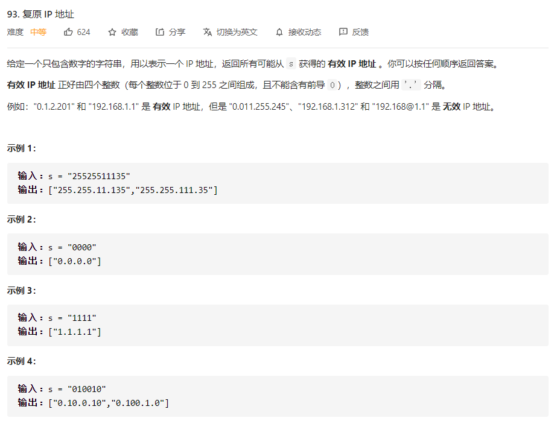
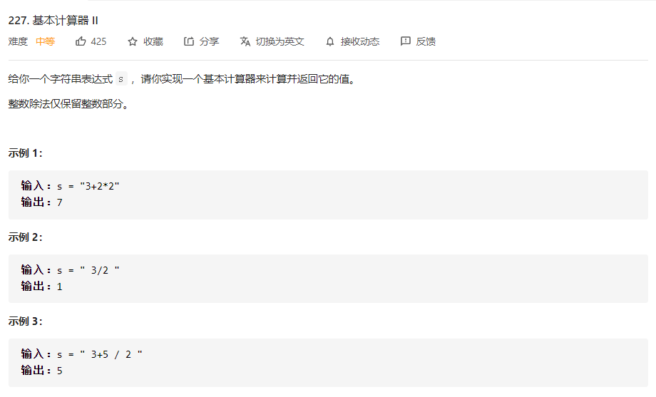
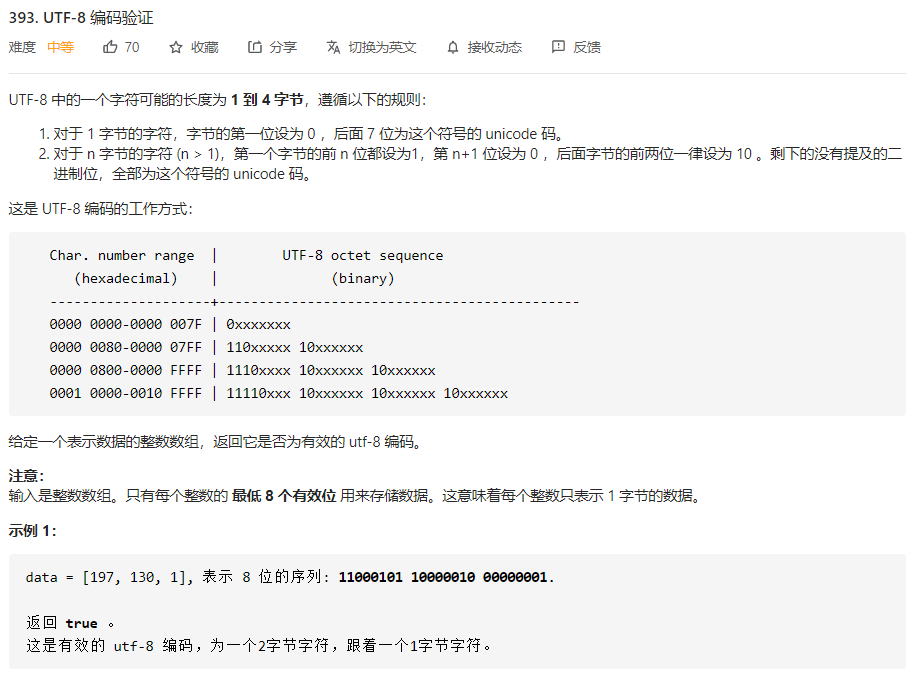

# 数据结构与算法 - 字符串


### 例题 1 - 最长回文子串
<https://leetcode-cn.com/problems/longest-palindromic-substring/>


```
# 双指针模板
String palindrome(String s, int l, int r) {
    // 防止索引越界
    while (l >= 0 && r < s.length()
            && s.charAt(l) == s.charAt(r)) {
        // 向两边展开
        l--; r++;
    }
    // 返回以 s[l] 和 s[r] 为中心的最长回文串
    return s.substring(l + 1, r);
    }

public String longestPalindrome(String s) {
    String res = "";
    for (int i = 0; i < s.length(); i++) {
        // 以 s[i] 为中心的最长回文子串
        String s1 = palindrome(s, i, i);
        // 以 s[i] 和 s[i+1] 为中心的最长回文子串
        String s2 = palindrome(s, i, i + 1);
        // res = longest(res, s1, s2)
        res = res.length() > s1.length() ? res : s1;
        res = res.length() > s2.length() ? res : s2;
    }
    return res;
}
```

```
# 动态规划
class Solution:
    def longestPalindrome(self, s: str) -> str:
        n = len(s)
        if n < 2:
            return s
        
        max_len = 1
        begin = 0
        # dp[i][j] 表示 s[i..j] 是否是回文串
        dp = [[False] * n for _ in range(n)]
        for i in range(n):
            dp[i][i] = True
        
        # 递推开始
        # 先枚举子串长度
        for L in range(2, n + 1):
            # 枚举左边界，左边界的上限设置可以宽松一些
            for i in range(n):
                # 由 L 和 i 可以确定右边界，即 j - i + 1 = L 得
                j = L + i - 1
                # 如果右边界越界，就可以退出当前循环
                if j >= n:
                    break
                    
                if s[i] != s[j]:
                    dp[i][j] = False 
                else:
                    if j - i < 3:
                        dp[i][j] = True
                    else:
                        dp[i][j] = dp[i + 1][j - 1]
                
                # 只要 dp[i][L] == true 成立，就表示子串 s[i..L] 是回文，此时记录回文长度和起始位置
                if dp[i][j] and j - i + 1 > max_len:
                    max_len = j - i + 1
                    begin = i
        return s[begin:begin + max_len]

作者：LeetCode-Solution
链接：https://leetcode-cn.com/problems/longest-palindromic-substring/solution/zui-chang-hui-wen-zi-chuan-by-leetcode-solution/
来源：力扣（LeetCode）
著作权归作者所有。商业转载请联系作者获得授权，非商业转载请注明出处。
```
```
# 中心扩展法
class Solution:
    def expandAroundCenter(self, s, left, right):
        while left >= 0 and right < len(s) and s[left] == s[right]:
            left -= 1
            right += 1
        return left + 1, right - 1

    def longestPalindrome(self, s: str) -> str:
        start, end = 0, 0
        for i in range(len(s)):
            left1, right1 = self.expandAroundCenter(s, i, i)
            left2, right2 = self.expandAroundCenter(s, i, i + 1)
            if right1 - left1 > end - start:
                start, end = left1, right1
            if right2 - left2 > end - start:
                start, end = left2, right2
        return s[start: end + 1]

作者：LeetCode-Solution
链接：https://leetcode-cn.com/problems/longest-palindromic-substring/solution/zui-chang-hui-wen-zi-chuan-by-leetcode-solution/
来源：力扣（LeetCode）
著作权归作者所有。商业转载请联系作者获得授权，非商业转载请注明出处。
```

### 例题 2 - 复原IP地址
<https://leetcode-cn.com/problems/restore-ip-addresses/>

```
class Solution:
    def restoreIpAddresses(self, s: str) -> List[str]:
        #结果存储函数
        result = []
        #当前路径
        path = []
        #回溯函数
        def back_track(s, index):
            #减枝，如果搜索路径大于4，直接返回
            if len(path) > 4:
                return 
            #全部搜素完成，搜索路径等于4，则加入结果列表
            if index == len(s) and len(path) == 4:
                result.append(".".join(path))
                return
            #遍历整个字符串，对每一个满足的子串递归回溯
            for i in range(index, len(s)):
                #减枝，如果当前值在0-255之前，则开始回溯
                if 0 <= int(s[index : i+ 1]) <= 255:
                    #如果当前值是0，但是不是一个单"0"则剪掉
                    if int(s[index : i+ 1]) == 0 and i != index:
                        continue
                    #如果当前值不是0，但是缺以"0XXX"开头，也应该剪掉
                    if int(s[index : i+ 1]) > 0 and s[index] == "0":
                        continue
                    #加入当前path
                    path.append(s[index: i+ 1])
                    #从当前节点开始递归
                    back_track(s, i + 1)
                    #回溯
                    path.pop()
        back_track(s, 0)
        return result

```

### 例题 3 - 基本计算器 II
<https://leetcode-cn.com/problems/basic-calculator-ii/>

维护一个栈，存放所有的数字。遇到减号取反入栈。遇到乘除，则将栈顶数字出栈，与当前数字计算并将结果入栈。
最后只要求栈中所有数字和即可。 
```
class Solution:
    def calculate(self, s: str) -> int:
        n = len(s)
        stack = []
        preSign = '+'
        num = 0
        for i in range(n):
            if s[i] != ' ' and s[i].isdigit():
                num = num * 10 + ord(s[i]) - ord('0')
            if i == n - 1 or s[i] in '+-*/':
                if preSign == '+':
                    stack.append(num)
                elif preSign == '-':
                    stack.append(-num)
                elif preSign == '*':
                    stack.append(stack.pop() * num)
                else:
                    stack.append(int(stack.pop() / num))
                preSign = s[i]
                num = 0
        return sum(stack)
```

### 例题 4 - UTF-8编码验证
<https://leetcode-cn.com/problems/utf-8-validation/>

```
class Solution:
    def validUtf8(self, data):
        """
        :type data: List[int]
        :rtype: bool
        """

        # Number of bytes in the current UTF-8 character
        n_bytes = 0

        # Mask to check if the most significant bit (8th bit from the left) is set or not
        mask1 = 1 << 7

        # Mask to check if the second most significant bit is set or not
        mask2 = 1 << 6
        for num in data:

            # Get the number of set most significant bits in the byte if
            # this is the starting byte of an UTF-8 character.
            mask = 1 << 7
            if n_bytes == 0:
                while mask & num:
                    n_bytes += 1
                    mask = mask >> 1

                # 1 byte characters
                if n_bytes == 0:
                    continue

                # Invalid scenarios according to the rules of the problem.
                if n_bytes == 1 or n_bytes > 4:
                    return False
            else:

                # If this byte is a part of an existing UTF-8 character, then we
                # simply have to look at the two most significant bits and we make
                # use of the masks we defined before.
                if not (num & mask1 and not (num & mask2)):
                    return False
            n_bytes -= 1
        return n_bytes == 0     

```
