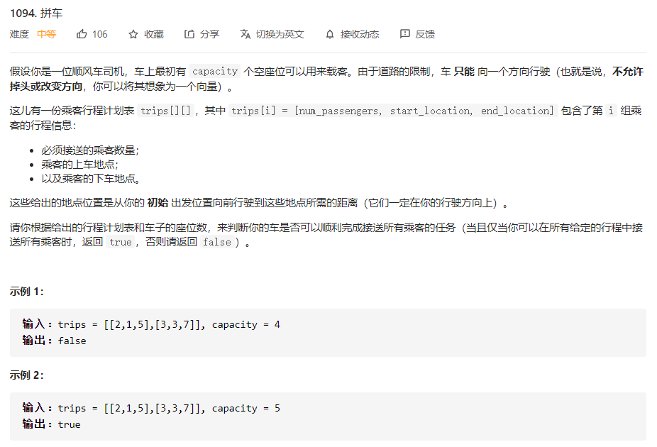
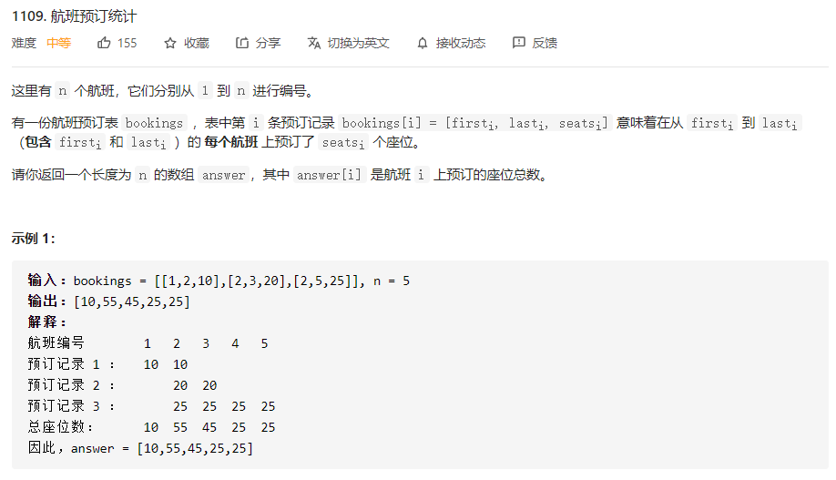

# 数据结构与算法 - 差分


### 简介
如果需要快速让数组中某个区间加上一个数，就需要用到差分。

### 例题 1 - 拼车
<https://leetcode-cn.com/problems/car-pooling/>

```
class Solution:
    def carPooling(self, trips: List[List[int]], capacity: int) -> bool:
        
        des = 1000 # 最远点
        f = [0] * des # 初始化差分队列

        for x, L, R in trips: # 差分
            f[L] += x
            f[R] -= x

        for i in range(1, des):
            f[i] = f[i-1] + f[i]
            if f[i] > capacity:
                return False
        
        return True
```

### 例题 2 - 航班预订统计
<https://leetcode-cn.com/problems/corporate-flight-bookings/>

```
class Solution:
    def corpFlightBookings(self, bookings: List[List[int]], n: int) -> List[int]:
        res = [0] * (n + 2)

        for first, last, seats in bookings:
            res[first] += seats
            res[last + 1] -= seats

        for i in range(1, n + 1):
            res[i] = res[i - 1] + res[i]

        return res[1:n + 1]
```
