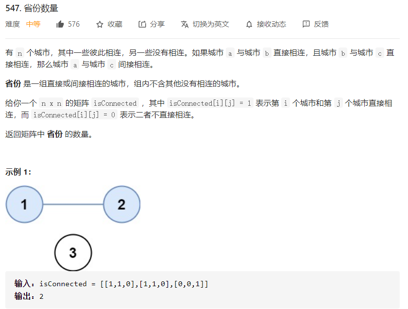

# 数据结构与算法 - 并查集


### 上概念
- **并查集：** Disjoint-Set，是用于处理一些不交集的合并及查询问题的一种数据结构，支持查询、合并以及添加操作。
- **合并：** Union，简单来说，就是把有关联的节点视为一个集群，每个集群用一个**祖宗节点**来表示。

- **查询：** Find，指的是依次查找某个节点的父节点，直至祖宗节点。

- **路径压缩：** 随着节点的加入，族谱层级可能会很深，这样查找效率很低。因此可以在由下至上查询的过程中，让当前向上移动，进而降低族谱层级，这就是**路径压缩**，单词操作复杂度为`O(logN)`。

### 上代码

```
class DisjointSet(object):
    "并查集"
    def __init__(self, n):
        """
        parent[i]表示节点i的父节点，初始化parent[i] = i，即每个节点的父节点均为自己
        rank[i]表示当前节点的后代层数，包括自己
        """
        self.parent = list(range(n))
        self.rank = [1] * n

    def get_root(self, i):
        if self.parent[i] != self.parent[self.parent[i]]:
            self.parent[i] = self.get_root(self.parent[i])
        return self.parent[i]

    def is_connected(self, i, j):
        return self.get_root(i) == self.get_root(j)

    def union(self, i, j):
        i_root = self.get_root(i)
        j_root = self.get_root(j)

        # 合并的时候，将层数少的树连接到层数多的树，以减少合并树的高度
        if self.rank[i_root] == self.rank[j_root]:
            self.parent[i_root] = j_root
            self.rank[j_root] += 1
        elif self.rank[i_root] > self.rank[j_root]:
            self.parent[j_root] = i_root
        else:
            self.parent[i_root] = j_root
 
```

### 例题 1 - 朋友圈（省份数量）
<https://leetcode-cn.com/problems/number-of-provinces/>

```
class DisjointSet:
    "并查集"
    def __init__(self, n):
        """
        parent[i]表示节点i的父节点，初始化parent[i] = i，即每个节点的父节点均为自己
        rank[i]表示当前节点的后代层数，包括自己
        """
        self.parent = list(range(n))
        self.rank = [1] * n
        self.num_of_sets = n

    def get_root(self, i):
        if self.parent[i] != self.parent[self.parent[i]]:
            self.parent[i] = self.get_root(self.parent[i])
        return self.parent[i]

    def is_connected(self, i, j):
        return self.get_root(i) == self.get_root(j)

    def union(self, i, j):
        i_root = self.get_root(i)
        j_root = self.get_root(j)

        # 合并的时候，将层数少的树连接到层数多的树，以减少合并树的高度
        if self.rank[i_root] == self.rank[j_root]:
            self.parent[i_root] = j_root
            self.rank[j_root] += 1
        elif self.rank[i_root] > self.rank[j_root]:
            self.parent[j_root] = i_root
        else:
            self.parent[i_root] = j_root
        
        self.num_of_sets -= 1

    def add(self, x):
        if x not in self.parent:
            self.parent[x] = None


class Solution:
    def findCircleNum(self, isConnected: List[List[int]]) -> int:
        uf = DisjointSet(len(isConnected))
        for i in range(len(isConnected)):
            for j in range(i):
                if isConnected[i][j] and not uf.is_connected(i, j):
                    uf.union(i, j)
        
        return uf.num_of_sets

```
