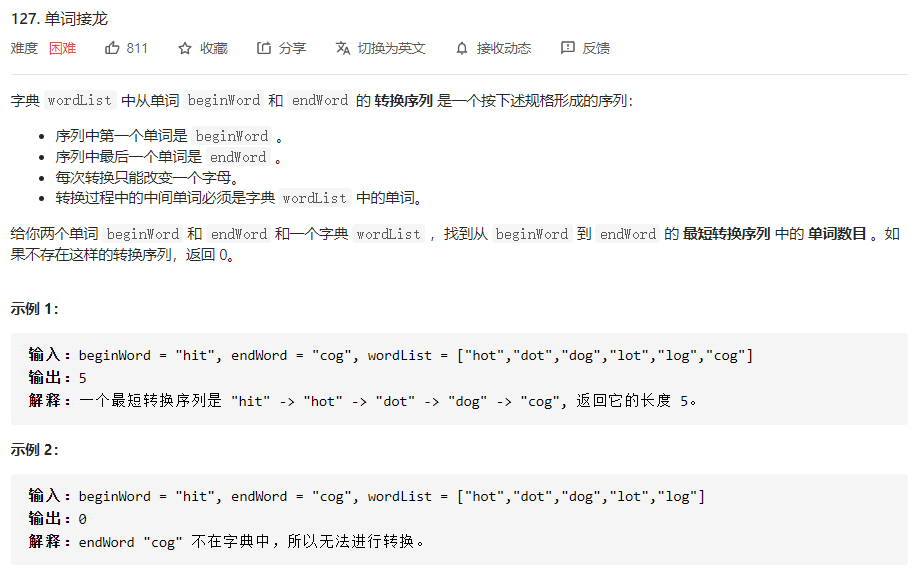
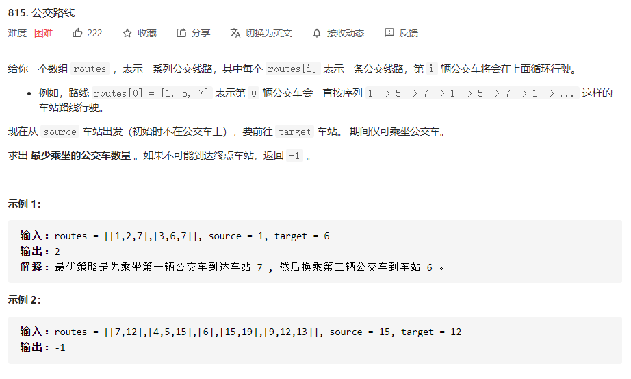

# 数据结构与算法 - 广度优先搜索


### 简介
常用来解决最短路径问题。

### 模板
```
from collections import deque
def search(name): # 广度优先搜索(BFS)
    search_quene = deque()
    search_quene += graph[name] # 传入初始节点
    searched = [] # 避免重复处理

    while search_quene:
    #队列中，pop()默认抛出右边元素，但是我们希望，append()从右边入队，popleft()从左边出队
        person = search_quene.popleft()
        if person not in searched:
        # bingo()判断当前是不是我们要找的人
            if bingo(person):
                return True
            else:
                search_quene += graph[person]
                searched.append(person)
    return False
```

### 例题 1 - 单词接龙
<https://leetcode-cn.com/problems/word-ladder/>

```
class Solution:
    def ladderLength(self, beginWord: str, endWord: str, wordList: List[str]) -> int:
        st=set(wordList) # 时间复杂都O(1)查找
        if endWord not in st:
            return 0
        m=len(beginWord)        

        queue=collections.deque()        
        queue.append((beginWord,1)) # 1表示step，即距离

        visited=set()
        visited.add(beginWord)

        while queue:
            cur,step=queue.popleft()
            if cur==endWord:
                return step
            
            for i in range(m): # 对当前单词中每个字母用26个字母替换，若新单词在wordList中且未访问过，入队列                
                for j in range(26):
                    tmp=cur[:i]+chr(97+j)+cur[i+1:]
                    if tmp not in visited and tmp in st:
                        queue.append((tmp,step+1))
                        visited.add(tmp)

        return 0

作者：yim-6
链接：https://leetcode-cn.com/problems/word-ladder/solution/python3-bfshe-shuang-xiang-bfsshi-xian-dan-ci-jie-/
来源：力扣（LeetCode）
著作权归作者所有。商业转载请联系作者获得授权，非商业转载请注明出处。
```
```
# 从beginWord和endWord分别做bfs，若从一端查到的节点已经在另一端的visited中，则说明可以相连且该节点为连接点
class Solution:
    def ladderLength(self, beginWord: str, endWord: str, wordList: List[str]) -> int:
        st=set(wordList)
        if endWord not in st:
            return 0
        m=len(beginWord)
        lvisited=set()
        rvisited=set()
        lqueue=collections.deque()
        rqueue=collections.deque()
        
        lqueue.append(beginWord)
        rqueue.append(endWord)

        lvisited.add(beginWord)
        rvisited.add(endWord)
        step=0

        while lqueue and rqueue:
            if len(lqueue)>len(rqueue):
                lqueue,rqueue=rqueue,lqueue
                lvisited,rvisited=rvisited,lvisited
            step+=1
            for k in range(len(lqueue)):
                cur=lqueue.popleft()
                if cur in rvisited:
                    return step
                
                for i in range(m):                
                    for j in range(26):
                        tmp=cur[:i]+chr(97+j)+cur[i+1:]
                        if tmp not in lvisited and tmp in st:
                            lqueue.append(tmp)
                            lvisited.add(tmp)
                       
        return 0


作者：yim-6
链接：https://leetcode-cn.com/problems/word-ladder/solution/python3-bfshe-shuang-xiang-bfsshi-xian-dan-ci-jie-/
来源：力扣（LeetCode）
著作权归作者所有。商业转载请联系作者获得授权，非商业转载请注明出处。
```

### 例题 2 - 公交路线
<https://leetcode-cn.com/problems/bus-routes/>

```
class Solution:
    def numBusesToDestination(self, routes: List[List[int]], source: int, target: int) -> int:
        # 每个车站可以乘坐的公交车
        stations = defaultdict(set)
        for i, stops in enumerate(routes):
            for stop in stops:
                stations[stop].add(i)
        # 每个公交车线路可以到达的车站
        routes = [set(x) for x in routes]

        q = deque([(source, 0)])
        # 已经乘坐了的公交车
        buses = set()
        # 已经到达了的车站
        stops = {source}
        while q:
            pos, cost = q.popleft()
            if pos == target:
                return cost
            # 当前车站中尚未乘坐的公交车
            for bus in stations[pos] - buses:
                # 该公交车尚未到达过的车站
                for stop in routes[bus] - stops:
                    buses.add(bus)
                    stops.add(stop)
                    q.append((stop, cost + 1))
        return -1
```
