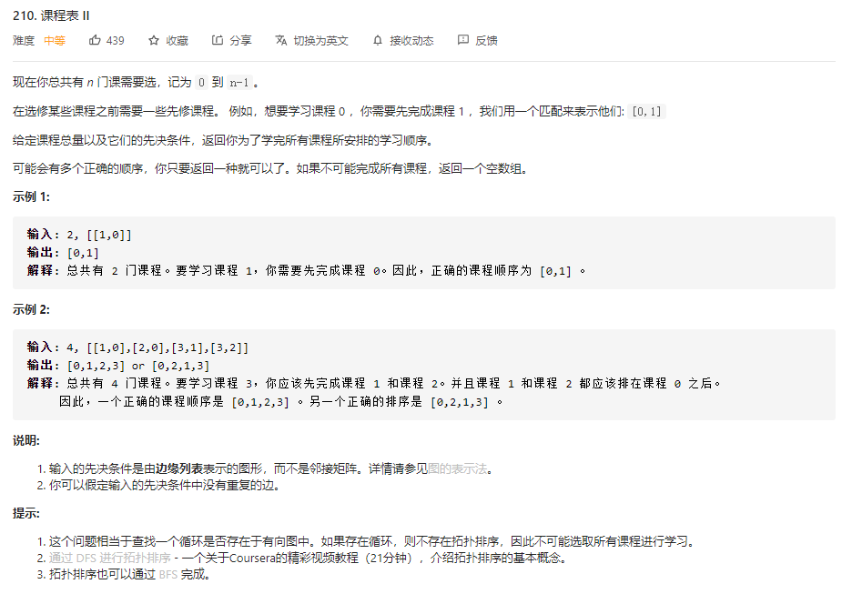

# 数据结构与算法 - 拓扑排序


### 简介

在图论中，拓扑排序（Topological Sorting）是一个有向无环图（DAG, Directed Acyclic Graph）的所有顶点的线性序列。

### 例题 1 - 课程表 II
<https://leetcode-cn.com/problems/course-schedule-ii/>

```
class Solution:
    def findOrder(self, numCourses: int, prerequisites: List[List[int]]) -> List[int]:
        res = []
        visited = [0] * numCourses
        adjacent = [[] for _ in range(numCourses)]

        # visited中包含两个状态
        # 1：正在访问的路径，如果遍历时遇到1，说明图中有环，无法进行拓扑排序
        # 2：已经访问过的路径，遇到直接跳过无需重复进入该节点
        def dfs(i):
            if visited[i] == 1:
                return False
            if visited[i] == 2:
                return True
            visited[i] = 1
            for j in adjacent[i]:
                if not dfs(j):
                    return False

            visited[i] = 2
            res.append(i)
            return True
        for cur, pre in prerequisites:
            adjacent[cur].append(pre)
        for i in range(numCourses):
            if not dfs(i):
                return []
        return res
```
