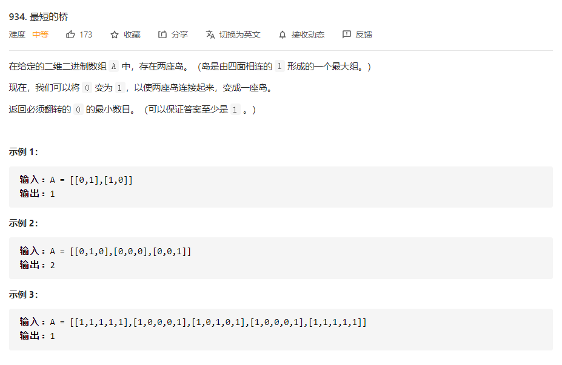
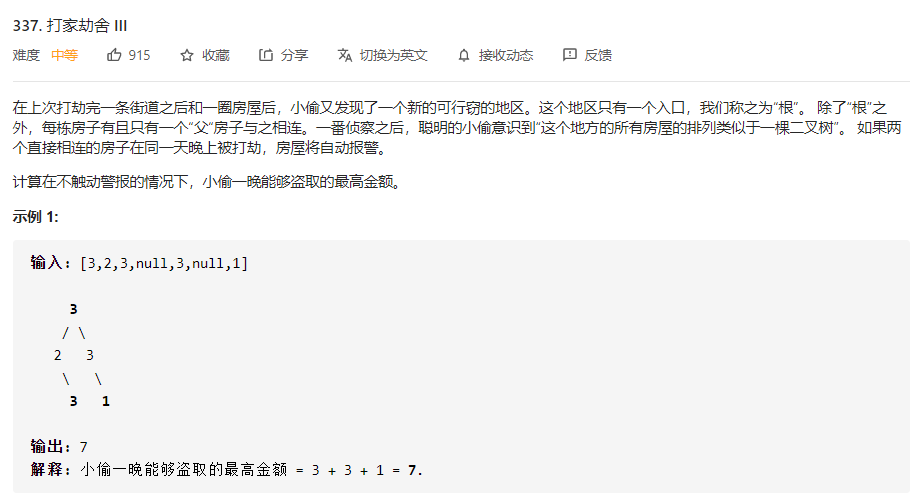

# 数据结构与算法 - 深度优先搜索


### 简介
本质就是枚举，只不过通过递归实现。


### 例题 1 - 最短的桥
<https://leetcode-cn.com/problems/word-ladder/>

```
# 1. 先dfs找到一个岛，并染色成2
# 2. 将1的所有节点放入deque中进行bfs，找到另一个岛的步数即为结果
class Solution:
  def shortestBridge(self,nums):
    def dfs(i,j): # 把找到的一个岛染成2，同时把找个岛的所有坐标放到队列q
      if i<0 or i>=len(nums) or j<0 or j>=len(nums[0]) or nums[i][j]==0 or nums[i][j]==2:  return
      if nums[i][j]==1:              
          nums[i][j]=2
          q.append((i,j))
          for x,y in dirs:
            newi,newj=x+i,y+j          
            dfs(newi,newj)

    def bfs(i,j): # 从找到的岛开始扩展，每扩展一层，steps+1
      steps=0
      while q:
        size=len(q)
        for _ in range(size):
          i,j=q.popleft()
          for x,y in dirs:
            newi,newj=x+i,y+j
            if newi<0 or newi>=len(nums) or newj<0 or newj>=len(nums[0])  or nums[newi][newj]==2:  continue
            if nums[newi][newj]==1:  return steps
            nums[newi][newj]=2
            q.append((newi,newj))
        steps+=1

    # main
    dirs=((1,0),(0,1),(-1,0),(0,-1))
    q=collections.deque()
    for i,row in enumerate(nums):
        for j,ele in enumerate(row):
            if ele==1:
              dfs(i,j)
              return bfs(i,j)
```

### 例题 2 - 打家劫舍III
<https://leetcode-cn.com/problems/house-robber-iii/>

```
# Definition for a binary tree node.
# class TreeNode:
#     def __init__(self, x):
#         self.val = x
#         self.left = None
#         self.right = None

# 偷值为偷该节点时的最大金额，不偷值为不偷该节点（即偷其左右子节点）时的最大金额
class Solution:
    def rob(self, root: TreeNode) -> int:
        a = self.helper(root)   # a 是一个二维数组, 为root的[偷值, 不偷值]
        return max(a[0], a[1])  # 返回两个值的最大值, 此值为小偷最终获得的总值
    
    # 参数为root节点, helper方法输出一个二维数组：root节点的[偷值, 不偷值]
    def helper(self, root):     # 递归结束条件：root为空, 输出 [0, 0]
        if not root:
            return [0, 0]
        left = self.helper(root.left)   # left是一个二维数组, 为 root 左侧子节点的[偷值, 不偷值]
        right = self.helper(root.right) # right也是一个二维数组, 为root右侧子节点的[偷值, 不偷值]
        robValue = left[1] + right[1] + root.val    # root 的偷值
        skipValue = max(left[0], left[1]) + max(right[0], right[1]) # root 的不偷值
        return [robValue, skipValue]    # 输出小偷可获得的最大金额

```
