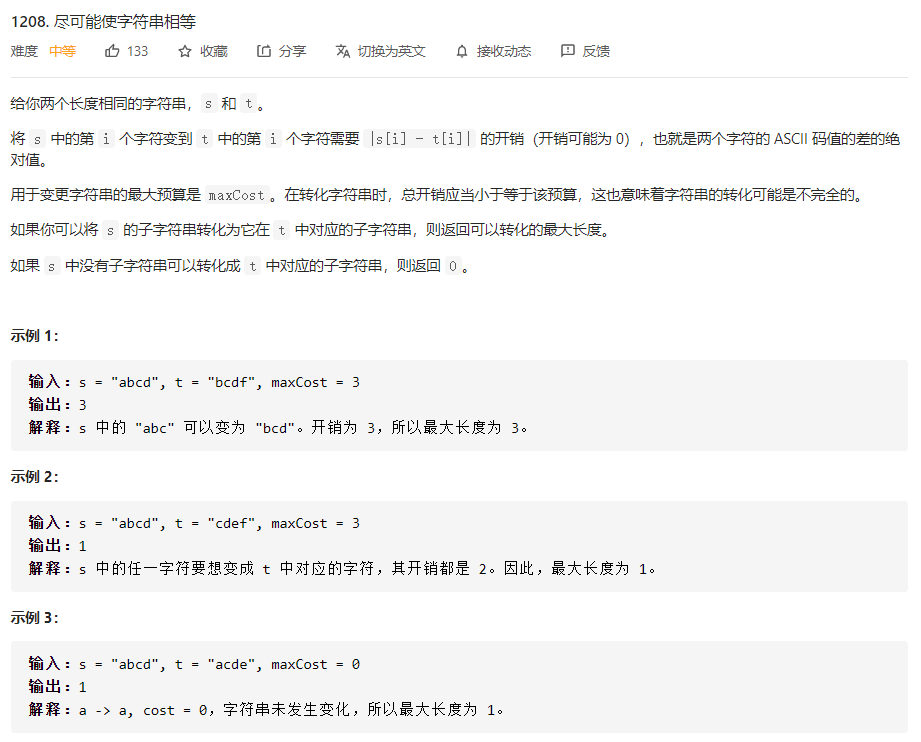
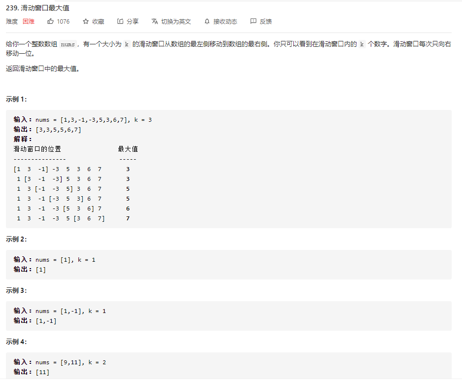
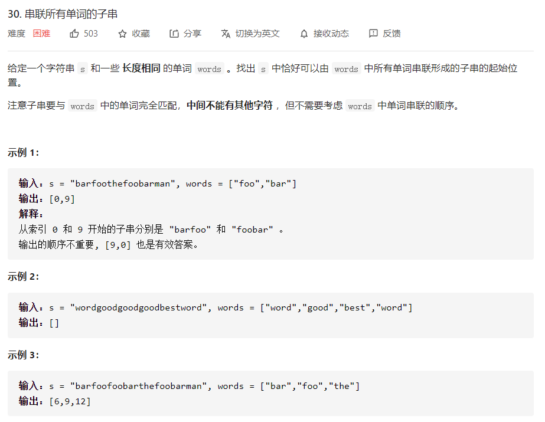

# 数据结构与算法 - 滑动窗口


### 简介
提到滑动窗口，最先想到的是TCP的流量控制，这里可以用来解决一些查找满足一定条件的连续区间的问题。

**例子**，给定数组为[2,3,1,2,4,3]，查找长度最小子数组，满足最小和s为7。当然可以枚举所有子数组求和，但会有很多重复计算，时间复杂度为O(N^2)，这里使用滑动窗口优化算法。

**实现**，给定一个滑动窗口，左右端分别为L和R，起始位置均为数组最左端。首先移动R，直至窗口区间满足给定条件，然后移动L，至区间不满足条件，再移动R。如此往复，并在过程中记录最优值。

### 代码模板
```
def findSubArray(nums):
    N = len(nums) # 数组/字符串长度
    left, right = 0, 0 # 双指针，表示当前遍历的区间[left, right]，闭区间
    sums = 0 # 用于统计 子数组/子区间 是否有效，根据题目可能会改成求和/计数
    res = 0 # 保存最大的满足题目要求的 子数组/子串 长度
    while right < N: # 当右边的指针没有搜索到 数组/字符串 的结尾
        sums += nums[right] # 增加当前右边指针的数字/字符的求和/计数
        while 区间[left, right]不符合题意：# 此时需要一直移动左指针，直至找到一个符合题意的区间
            sums -= nums[left] # 移动左指针前需要从counter中减少left位置字符的求和/计数
            left += 1 # 真正的移动左指针，注意不能跟上面一行代码写反
        # 到 while 结束时，我们找到了一个符合题意要求的 子数组/子串
        res = max(res, right - left + 1) # 需要更新结果
        right += 1 # 移动右指针，去探索新的区间
    return res

作者：fuxuemingzhu
链接：https://leetcode-cn.com/problems/get-equal-substrings-within-budget/solution/fen-xiang-zhen-cang-de-hua-dong-chuang-k-e3rd/
来源：力扣（LeetCode）
著作权归作者所有。商业转载请联系作者获得授权，非商业转载请注明出处。
```

### 例题 1 - 尽可能使字符串相等
<https://leetcode-cn.com/problems/get-equal-substrings-within-budget/>

```
class Solution:
    def equalSubstring(self, s: str, t: str, maxCost: int) -> int:
        N = len(s)
        if N == 0:
            return 0
        costs = [abs(ord(s[i]) - ord(t[i])) for i in range(N)]
        left, right = 0, 0
        cost = 0
        max_len = 0

        while right < N:
            cost += costs[right]
            while cost > maxCost:
                cost -= costs[left]
                left += 1
            max_len = max(max_len, right - left + 1)
            right += 1

        return max_len
```

### 例题 2 - 滑动窗口最大值
<https://leetcode-cn.com/problems/sliding-window-maximum/>

```
class Solution:
    def maxSlidingWindow(self, nums: List[int], k: int) -> List[int]:
        '''
        思路:
            1. 利用双端队列记录当前滑动窗口的元素索引
            2. 队列最左侧元素记录滑动窗口中最大元素的索引
            3. 遍历数组：
            - 如果队列最左侧索引已不在滑动窗口范围内，弹出队列最左侧索引
            - 通过循环确保队列的最左侧索引所对应元素值最大
            - 新元素入队
            - 从第一个滑动窗口的末尾索引开始将最大值存储到结果res中
        '''
        res = []
        dq = deque()
        for i, v in enumerate(nums):
            if dq and dq[0] < i - k + 1:
                dq.popleft()
            while dq and nums[dq[-1]] < v:
                dq.pop()
            dq.append(i)
            if i >= k - 1:
                res.append(nums[dq[0]])
        return res
```

### 例题 3 - 串联所有单词的子串
<https://leetcode-cn.com/problems/substring-with-concatenation-of-all-words/>


这题最秀的地方不是滑动窗口，是如何判断子串是否满足条件。可以用两个 HashMap 来解决。

首先，我们把所有的单词存到 HashMap 里，key 直接存单词，value 存单词出现的个数（因为给出的单词可能会有重复的，所以可能是 1 或 2 或者其他）。然后扫描子串的单词，如果当前扫描的单词在之前的 HashMap 中，就把该单词存到新的 HashMap 中，并判断新的 HashMap 中该单词的 value 是不是大于之前的 HashMap 该单词的 value ，如果大了，就代表该子串不是我们要找的，接着判断下一个子串就可以了。如果不大于，那么我们接着判断下一个单词的情况。子串扫描结束，如果子串的全部单词都符合，那么该子串就是我们找的其中一个。

参考： <https://leetcode-cn.com/problems/substring-with-concatenation-of-all-words/solution/xiang-xi-tong-su-de-si-lu-fen-xi-duo-jie-fa-by-w-6/>


```
class Solution:
    def findSubstring(self, s: str, words: List[str]) -> List[int]:
        if not s or not words:
            return []
        n = len(s)
        one_word_len = len(words[0])
        word_cnt = len(words)
        all_len = one_word_len * word_cnt

        words_cnt = defaultdict(int)           # 给定words的词数表
        for w in words:
            words_cnt[w] += 1

        res = [] 
        for i in range(one_word_len):          # 外层对一个单词长度循环，这里需要思考下，
                                               # 窗口给按单词长度滑动，这样可以覆盖所有情况
            cur_w_num = 0                      # 单词个数
            L, R = i, i
            cur_w_dic = defaultdict(int)       # 当前单词的次数统计
            while R + one_word_len <= len(s):
                w = s[R: R + one_word_len]
                R += one_word_len              # R每次像右移一个单词的长度

                if w not in words_cnt:         # 结束前，出现个不知道哪里的单词，整个前面一片就废了
                    L = R
                    cur_w_dic.clear()
                    cur_w_num = 0
                else:
                    cur_w_dic[w] += 1
                    cur_w_num += 1
                    while cur_w_dic[w] > words_cnt[w]:      # 单词超量，移动L，更新计数
                        L_w = s[L : L + one_word_len]
                        L += one_word_len
                        cur_w_dic[L_w] -= 1
                        cur_w_num -= 1
                    if cur_w_num == word_cnt:               # 满足条件，结果赋值
                        res.append(L)
        
        return res
```
